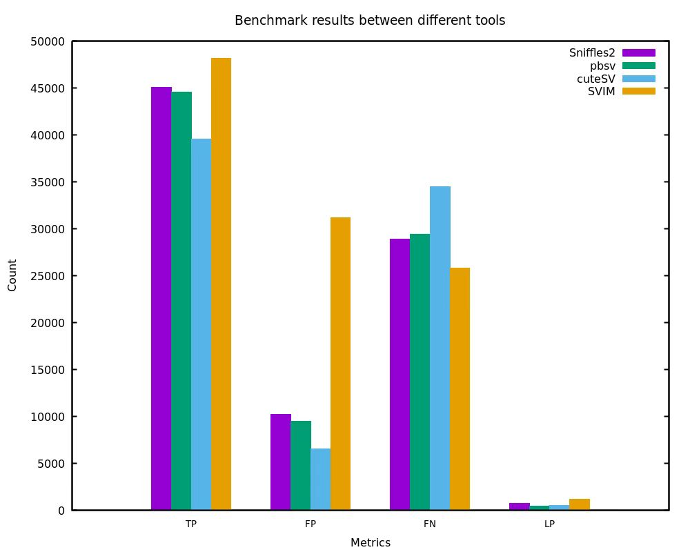

# SV_STAT
A tool for Structural Variation Statistics Evaluation

-------------------
SV_STAT is a tool for Structural Variation (SV) Statistics Evaluation. SV_STAT uses a user-called SV set and a benchmark data set as input. It first computes the traditional metrics, such as the number of true positives (TPs), false positives (FPs), false negatives (FNs), recall, precision and F1 score; and it then computes the variant region size difference between the user-called variants and the corresponding ones in the benchmark data set by computing the distance between their region centers, and it also computes the region size ratio for the two variant regions; and finally, it computes the statistics for variants with vary region sizes. A notable feature of SV_STAT is its capability to evaluate multiple identification results and generate information-rich chart information. This provides a more intuitive showcase of the performance of different detection methods. At the same time, SV_STAT supports multi-sample evaluation on the same benchmark set, providing a more intuitive display of the comparative results between samples.

For more detailed experiment information, please refer to [sv_stat-experiments](https://github.com/zhuxiao/sv_stat-experiments).

## Introduction
SV_STAT is a comprehensive tool for evaluating the results of structural variant identification. Taking the VCF files as input, SV_STAT utilizes multiple structural variant similarity metrics, including reference distance, SV type matching, mutual overlap, size similarity, and sequence consistency to provide an improved approach to structural variant matching. SV_STAT supports multi-sample evaluation and generates detailed graphical information. The workflow of SV_STAT is briefly explained in the following diagram:

<div align="center">
 
</div>

## Prerequisites
SV_STAT depends on the following libraries and tools:
* HTSlib (http://www.htslib.org/download/)
* g++ (v4.7 or higher which supports c++11)
* gnuplot (v5.4 http://gnuplot.info/download.html)

The above library and tools should be installed before compiling SV_STAT.

## Download and install ##

You can "install" SV_STAT in two different ways:
### Compilation from Source

#### Dependencies for SV_STAT
* Debian / Ubuntu 
```
$ sudo apt update  # Ensure the package list is up to date
$ sudo apt install g++ gnuplot
```
HTSlib needs to be installed from source files.

* RedHat / CentOS
```
$ sudo yum check-update # Ensure the package list is up to date
$ sudo yum install gcc-c++ gnuplot
```
HTSlib needs to be installed from source files.

#### Compiling SV_STAT

The binary file can be generated by typing:
```sh
$ git clone https://github.com/zhuxiao/sv_stat
$ cd sv_stat/
$ ./autogen.sh
```
And the binary file `sv_stat` will be output into the folder `bin` in this package directory.

### Install from Docker
Clone this repository and build a Docker image as follows. A pre-built docker image can be found here: https://hub.docker.com/xxx.  It can be obtained by running:

```sh
$ docker pull xxx
```

If the current directory contains a clone of the hap.py repository, hap.py can be run in Docker as follows:


```sh
docker run -it --name xxx -v `pwd`:/data_test sv_stat_test ./sv_stat -m 50000 /data_test/reference.fa /data_test/user_sv.vcf /data_test/benchmark_sv.vcf -o /data_test/test
```
or
```sh
docker run -it --name xxx -v `pwd`:/data_test sv_stat_test ./sv_stat -m 50000 -T "tool1;tool2;tool3" /data_test/reference.fa /data_test/user_sv.vcf /data_test/user1_sv.vcf /data_test/user2_sv.vcf /data_test/benchmark_sv.vcf -o /data_test/test
```
The -v argument mounts the current directory as /data_test in the Docker image. The output should also appear in the current directory.

The complete list of dependencies / packages to install beforehand can be found in the Dockerfile(xxx).

## File format description

Before using SV_STAT, both the user-called SV set and the benchmark data set are in the extended bed file format with the first 7 columns are below:
```sh
chromosome	start_ref_pos	end_ref_pos	SV_type	SV_len	Ref	Alt
```
Ensure that the first five columns of the CSV file meet the following format when converting it to the extended BED file format: 
```sh
chromosome,start_ref_pos,end_ref_pos,SV_type,SV_len,Ref,Alt
```
For translocations, the file format should be bedpe before using SV_STAT, and the first 10 columns are listed as below:
```sh
chromosome1	start_ref_pos1	end_ref_pos1	chromosome2	start_ref_pos2	end_ref_pos2	SV_type	SV_len	Ref	Alt
```
The SV_type can be TRA or BND, and the SV_len will be 0.

Note that: In SV_STAT, all variant types, including translocations, can be stored together in the same file as the input, for example:
```sh
chr1	1167806	1168012	DEL	-206	ATCG...	A
chr1	1142384	1142384	INS	87	T	TCGA...	
chr1	841980	843383	INV	1404	A	ACGT...
chr1	3327738	3329244	DUP	3013	C	CATG...	
chr1	1	481701	chr2	4273477	4539804	TRA	0	-	-
```		
For the second item, there is a insertion of size 87 base pairs at the 1142381 location of chr1, and for the fifth item, it is a translocation between chr1:1-481701 and chr2:4273477-4539804, and the 0 in the last second column means the SV_len which will be 0 for translocations or translocation breakpoints.


## General usage
The help information are below:
```sh
$ sv_stat
Program: SV_STAT (A tool for Structural Variant Statistics Evaluation)
Version: 1.0.0

Usage:  sv_stat [options] <USER_FILE> [<USER_FILE1>...] <BENCH_FILE> <REF_FILE>

Description:
   USER_FILE   User called SV result file.
   BENCH_FILE  Benchmark SV file.
   REF_FILE    Reference file.

Options:
   -m INT    valid maximal region size for statistics: [50000]
             0 is for all variant size are valid, and while positive
             values are for the valid maximal region size, then longer
             regions are omitted and saved to the file specified with '-l' option
   -S        enable the strict type match mode which is disabled by default.
             There are two variation type match modes:
             loose: allow type match between DUP and INS, which takes effect by '-S' option
             strict: strict type match which is disabled by default
             The default enabled match mode is 'loose' to allow the type match between DUP and INS.
   -C STR    Chromosomes to be processed: [null]
             no decoy indicates not specifying the chromosome set for evaluation.
             This parameter is used to specify the chromosomes to be evaluated.
             Chromosome names should match the format within the VCF file. 
             Chromosome names are separated by ';'. Example: -C "1;2;3" 
   -s INT    overlap extend size: [200]
   -t INT    number of threads [0]. 0 for the maximal number of threads
             in machine
   -T STR    Tool names [null]. 0 indicates that the tool name is not entered.
             This parameter is used for comparing multiple datasets. The number
             of inputs should be consistent with the data set. Tool names are 
             separated by ';'. Example: -T "tool1;tool2;tool3" 
   -o FILE   output directory: [output]
   -l FILE   file name of long SV regions: [long_sv_reg.bed]
   -r FILE   file name of evaluation results to report: [sv_stat_reports.html]
             Ensure that the filename extension is '.html'.
   -v        show version information
   -h        show this help message and exit

Example:
   # run the evaluation on the user-called set (method) for a single sample to allow match between DUPs as INSs
   $ sv_stat -T method user_sv.vcf benchmark_sv.vcf ref.fa

   # run the evaluation on the user-called set (method) for a single sample to perform the strict type matching by '-S' option
   $ sv_stat -T method -S user_sv.vcf benchmark_sv.vcf ref.fa

   # run the evaluation on the user-called sets (tool1, tool2 and tool3) for multiple samples
   $ sv_stat -T "tool1;tool2;tool3" user_sv1.vcf user_sv2.vcf user_sv3.vcf benchmark_sv.vcf ref.fa
```


### Use cases
Invalid long user-called regions can be removed by using `-m` option as they are too long to be valid variant regions. The command could be:
```sh
$ sv_stat -m 10000 -T method user_sv.vcf benchmark_sv.vcf reference.fa
```
Evaluating multiple identification result datasets can be achieved by using the '-T' option. Please use the following command:
```sh
$ sv_stat -m 10000 -T "tool1;tool2;tool3" user1_sv.vcf user2_sv.vcf user3_sv.vcf benchmark_sv.vcf reference.fa
```

## Draw statistical figures
There are 4 statistical categories for `stat` command results, figures can be drawn for more intuitive and detailed illustration for the four statistical categories:
* __`1_ref_reg_size_stat`__: record the statistical graph of SV sizes in the user-called data set and the benchmark data set.
* __`2_num_stat`__: generate the bar chart for the classification evaluation metrics.
* __`3_size_dif_stat`__: record statistical graphs of the size ratio and central difference in the overlapping variant regions between the user-called dataset and the benchmark data set.
* __`4_size_num_stat`__: generate a bar chart of classification evaluation metrics for variants with varying region sizes.
Additionally, when evaluating user-called sets from multiple tools, classification evaluation metric charts will be generated and saved in a 'figures' folder.

## Output Result Description
The detailed evaluation information for the 4 statistical categories for `stat` command results, which is saved into the following 4 folders respectively:
* __`1_ref_reg_size_stat`__: variant region size statistics (and the statistical figures) in reference.
* __`2_num_stat`__: the classical number statistics (and the statistical figures), e.g. TP, FP, FN, Recall, Precision, F1 score.
* __`3_size_dif_stat`__: the region size difference and ratio statistics (and statistical figures) for the overlapped variants between the user-called data set and the benchmark data set.
* __`4_size_num_stat`__: the classical number statistics (and the statistical figures) for variants with vary region lengths.
Moreover, the overall simplified statistics will be output to the terminal screen, and these screen results will be saved to the file `stat_screen` in the output directory.


## Example Usage
Here, practical examples for the evaluation of single-sample and multiple samples are provided. For multi-sample evaluations, it is strongly recommended to use the "-T" parameter for better differentiation of different identification results. Evaluate the identification results of chr1 of the HG002 CCS data separately using cuteSV (v2.0.3), pbsv (v2.9.0), and Sniffles (v2.0.2).
To evaluate the identification results for a single sample, please use the following command:
```sh
$ sv_stat -m 50000 -T cuteSV cuteSV_chr1.vcf benchmark_sv.vcf reference.fa
```
To evaluate the results of multiple identification outcomes, please use the following command:
```sh
$ sv_stat -m 50000 -T "cuteSV;pbsv;Sniffles" cuteSV_chr1.vcf pbsv_chr1.vcf Sniffles_chr1.vcf benchmark_sv.vcf reference.fa
```

Multisample evaluation statistical results. The evaluation of recognition results will primarily generate the following information. This example compares a run result of cuteSV 2.0.3 on NA24385, with the benchmark dataset being the high-confidence HG002 dataset created by the Genome in a Bottle Consortium (GIAB). More specific information can be found in the respective file:

<table>
  <thead>
    <tr>
    	  <th></th>
    	  <th>benchmark data size</th>
      <th>user-call data size</th>
      <th>filtered user-call data size</th>
      <th>TP_benchmark</th>
      <th>TP_user</th>
      <th>FP</th>
      <th>FN</th>
      <th>Recall</th>
      <th>precision_user</th>
      <th>F1 score_user</th>
      <th>precision_benchmark</th>
      <th>F1 score_benchmark</th>
      <th>Seqcons</th>
    </tr>
  </thead>
  <tbody>
    <tr>
    <th>count</th>
    <th>74012</th>
      <th>44937</th>
      <th>44928</th>
      <th>39442</th>
      <th>36955</th>
      <th>6413</th>
      <th>34570</th>
      <th>0.532914</th>
      <th>0.852126</th>
      <th>0.655735</th>
      <th>0.860146k</th>
      <th>0.658096</th>
       <th>0.923024</th>
    </tr>
  </tbody>
</table>
Moreover, for regions with overlapping variations, the quantities of region size ratio and center distance were statistically analyzed to provide a more intuitive presentation of evaluation information. Here, only a partial set of results is presented, and more detailed statistical outcomes can be reviewed in the respective files or graphical representations:

<table>
  <thead>
    <tr>
    	  <th><b>range</b></th>
      <th><b>-300--251</b></th>
      <th><b>-250--201</b></th>
      <th><b>-200--151</b></th>
      <th><b>-150--101</b></th>
      <th><b>-100--51</b></th>
      <th><b>-50--1</b></th>
      <th><b>0-50</b></th>
      <th><b>51-100</b></th>
      <th><b>101-150</b></th>
      <th><b>151-200</b></th>
      <th><b>201-250</b></th>
      <th><b>251-300</b></th>
    </tr>
  </thead>
  <tbody>
    <tr>
    <th>region size ratio (count)</th>
      <th>140</th>
      <th>181</th>
      <th>203</th>
      <th>345</th>
      <th>696</th>
      <th>5255</th>
      <th>25892</th>
      <th>3471</th>
      <th>1689</th>
      <th>1178</th>
      <th>934</th>
      <th>878</th>
    </tr>
  </tbody>
  <thead>
    <tr>
    	  <th><b>range</b></th>
      <th><b>0.0-0.5</b></th>
      <th><b>0.5-0.7</b></th>
      <th><b>0.7-1.2</b></th>
      <th><b>1.2-2.0</b></th>
      <th><b>2.0-5.0</b></th>
      <th><b>5.0-10.0</b></th>
      <th><b>10.0-50.0</b></th>
      <th><b>50.0-100.0</b></th>
      <th><b>>100.0</b></th>
    </tr>
  </thead>
  <tbody>
    <tr>
    <th>center distance (count)</th>
      <th>3883</th>
      <th>290</th>
      <th>37294</th>
      <th>500</th>
      <th>417</th>
      <th>81</th>
      <th>553</th>
      <th>255</th>
      <th>1738</th>
    </tr>
  </tbody>
</table>

Additionally, basic metrics for different structural variant (SV) size ranges were computed, primarily categorized into the following seven intervals. The results are displayed below:

<table>
  <thead>
    <tr>
    	  <th>region</th>
      <th>TP_benchmark</th>
      <th>TP_user</th>
      <th>FP</th>
      <th>FN</th>
      <th>Recall</th>
      <th>precision_user</th>
      <th>F1 score_user</th>
      <th>precision_benchmark</th>
      <th>F1 score_benchmark</th>
      <th>Seqcons</th>
    </tr>
  </thead>
  <tbody>
    <tr>
    	  <th>1-100bp</th>
      <th>33850</th>
      <th>31715</th>
      <th>5248</th>
      <th>30294</th>
      <th>0.527719</th>
      <th>0.85802</th>
      <th>0.653505</th>
      <th>0.865773</th>
      <th>0.655741</th>
      <th>0.912349</th>
    </tr>
    <tr>
    	  <th>101-250bp</th>
      <th>1866</th>
      <th>1686</th>
      <th>546</th>
      <th>2092</th>
      <th>0.47145</th>
      <th>0.755376</th>
      <th>0.580559</th>
      <th>0.773632</th>
      <th>0.585871</th>
      <th>1.000000</th>
    </tr>
    <tr>
    	  <th>251-500bp</th>
      <th>1618</th>
      <th>1577</th>
      <th>891</th>
      <th>1354</th>
      <th>0.544415</th>
      <th>0.638979</th>
      <th>0.587918</th>
      <th>0.644878</th>
      <th>0.590403</th>
      <th>1.000000</th>
    </tr>
    <tr>
    	  <th>501-1000bp</th>
      <th>349</th>
      <th>341</th>
      <th>472</th>
      <th>763</th>
      <th>0.313849</th>
      <th>0.419434</th>
      <th>0.35904</th>
      <th>0.425091</th>
      <th>0.361097</th>
      <th>1.000000</th>
    </tr>
    <tr>
    	  <th>1001-5000bp</th>
      <th>522</th>
      <th>512</th>
      <th>166</th>
      <th>716</th>
      <th>0.421648</th>
      <th>0.755162</th>
      <th>0.541145</th>
      <th>0.758721</th>
      <th>0.542056</th>
      <th>1.000000</th> 
    </tr>
    <tr>
    	  <th>5001-1000bp</th>
      <th>113</th>
      <th>113</th>
      <th>18</th>
      <th>223</th>
      <th>0.33631</th>
      <th>0.862595</th>
      <th>0.48394</th>
      <th>0.862595</th>
      <th>0.48394</th>
      <th>1.000000</th>
    </tr>
    <tr>
    	  <th>>=10001bp</th>
      <th>39</th>
      <th>40</th>
      <th>43</th>
      <th>213</th>
      <th>0.154762</th>
      <th>0.481928</th>
      <th>0.234287</th>
      <th>0.47561</th>
      <th>0.233533</th>
      <th>1.000000</th>
    </tr>
  </tbody>
</table>

The figure below displays the evaluation results of different detection methods, including two categories of basic metrics. Detailed statistics can be found in the corresponding text files within the respective folders.

<div style="text-align:center;">
 

</div>

------------------------------------------------------------------------------
## Contact
If you have any problems, comments, or suggestions, please contact xzhu@ytu.edu.cn without hesitation. Thank you very much!.

---- Enjoy !!! -----

