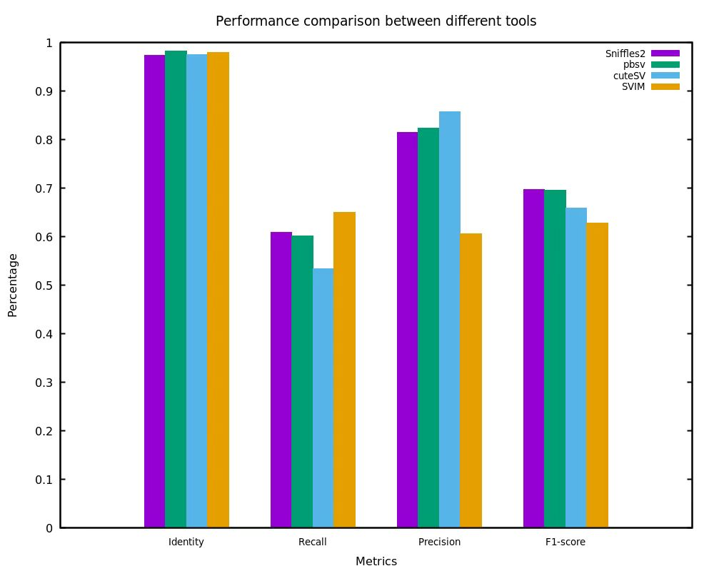

# ASVBM
A tool for Allele-aware Structural Variant statistics Benchmarking for Multiple callsets

-------------------
ASVBM is A tool for Allele-aware Structural Variant statistics Benchmarking for Multiple callsets. ASVBM uses user-provided callsets and a benchmark data set as input. It first computes the basics metrics, such as the number of true positives (TPs), false positives (FPs), false negatives (FNs), sequence identity, recall, precision, and F1 score. It then computes the variant region size difference between the user-called variants and the corresponding ones in the benchmark data set by computing the distance between their breakpoint distance, and it also calculates the variant size ratio for the two variant regions. Finally, it computes the statistics for variants with various region sizes. A notable feature of ASVBM is its capability to benchmark multiple identification results and generate information-rich chart information. This provides a more intuitive showcase of the performance of different detection methods. At the same time, ASVBM supports multiple user callsets benchmarking on the same benchmark set, providing a more intuitive display of the comparative results between samples.

For more detailed experiment information, please refer to [asvbm-experiments](https://github.com/zhuxiao/asvbm-experiments).

## Introduction
ASVBM is a comprehensive tool for benchmarking the results of structural variant identification. Taking the VCF files as input, ASVBM utilizes multiple structural variant similarity metrics, including reference distance, SV type matching, reciprocal overlap, size similarity, and sequence identity to provide an improved approach to structural variant matching. ASVBM supports multiple user callsets benchmarking and generates detailed graphical information. The workflow of ASVBM is briefly explained in the following diagram:

<div align="center">
 
</div>
When benchmarking the performance of a tool, we rely on a set of quantitative metrics to measure its accuracy and practicality. Here are some commonly used benchmarking metrics  that can help us understand the different aspects of tool performance:
<table>
  <tr>
    <th style="text-align: center;">Metrics</th>
    <th style="text-align: center;">Definition</th>
  </tr>
    <tr>
    <td>#SVs_bench</td>
    <td>Number of SVs in the benchmark set</td>
  </tr>
  <tr>
    <td>#SVs_user</td>
    <td>Number of SVs in the use set</td>
  </tr>
   <tr>
    <td>#SVs_filtered_user</td>
    <td>Number of SVs in the filtered use set</td>
  </tr>
  <tr>
    <td>#TP_bench</td>
    <td>Number of true positive variations in the benchmark set</td>
  </tr>
  <tr>
    <td>#TP_user</td>
    <td>Number of true positive variations in the use set</td>
  </tr>
  <tr>
    <td>#FP</td>
    <td>The number of falsely identified targets or events</td>
  </tr>
  <tr>
    <td>#FN</td>
    <td>The number of targets or events that were missed or incorrectly identified</td>
  </tr>
  <tr>
    <td>Recall</td>
    <td>TP_bench / (TP_bench + FN)</td>
  </tr>
  <tr>
    <td>Precision</td>
    <td>TP_user / (TP_user + FP)</td>
  </tr>
   <tr>
    <td>F1 score</td>
    <td>2 * ((Recall * Precision) / (Recall + Precision))</td>
  </tr>
  <tr>
    <td>Identity</td>
    <td>The sequence identity for matched SV pairs that include sequences</td>
  </tr>
   <tr>
    <td>the breakpoint distance</td>
    <td>The quantitative distribution of the breakpoint distance for overlapping variants</td>
  </tr>
  <tr>
    <td>the variant size ratio</td>
    <td>The region size distribution of the variant size ratio for overlapping variants</td>
  </tr>
</table>

Additionally, SVs within seven sub-intervals are benchmarked individually, and metrics for TP_bench, TP_user, FP, FN, Recall, Precision, F1 score, and sequence identity are calculated.
## Prerequisites
ASVBM depends on the following libraries and tools:
* HTSlib (http://www.htslib.org/download/)
* g++ (v4.7 or higher which supports c++11)
* gnuplot (v5.4 http://gnuplot.info/download.html)

The above library and tools should be installed before compiling ASVBM.

## Download and install ##

You can "install" ASVBM in two different ways:
### Compilation from Source

#### Dependencies for ASVBM
* Debian / Ubuntu 
```
$ sudo apt update  # Ensure the package list is up to date
$ sudo apt install g++ gnuplot
$ sudo apt install -y r-base r-base-dev
# Install the UpSetR package
$ R
$ install.packages("UpSetR")
```
HTSlib needs to be installed from source files.

* RedHat / CentOS
```
$ sudo yum check-update # Ensure the package list is up to date
$ sudo yum install gcc-c++ gnuplot
$ sudo yum install R
# Install the UpSetR package
$ R
$ install.packages("UpSetR")
```
HTSlib needs to be installed from source files.

#### Compiling ASVBM

The binary file can be generated by typing:
```sh
$ git clone https://github.com/zhuxiao/asvbm.git
$ cd ASVBM/
$ ./autogen.sh
```
And the binary file `ASVBM` will be output into the folder `bin` in this package directory.

### Install from Docker
Clone this repository and build a Docker image as follows. A pre-built docker image can be found here: https://hub.docker.com/xxx.  It can be obtained by running:

```sh
$ docker pull xxx
```

If the current directory contains a clone of the asvbm repository, asvbm can be run in Docker as follows:


```sh
docker run -it --name xxx -v `pwd`:/data_test ASVBM_test ./asvbm -m 50000 /data_test/reference.fa /data_test/user_sv.vcf /data_test/benchmark_sv.vcf -o /data_test/test
```
or
```sh
docker run -it --name xxx -v `pwd`:/data_test ASVBM_test ./asvbm -m 50000 -T "tool1;tool2;tool3" /data_test/reference.fa /data_test/user_sv.vcf /data_test/user1_sv.vcf /data_test/user2_sv.vcf /data_test/benchmark_sv.vcf -o /data_test/test
```
The -v argument mounts the current directory as /data_test in the Docker image. The output should also appear in the current directory.

The complete list of dependencies/packages to install beforehand can be found in the Dockerfile(xxx).

## File format description

Before using ASVBM, both the user-called SV set and the benchmark data set are in the extended bed file format with the first 8 columns are below:
```sh
chromosome	start_ref_pos	end_ref_pos	SV_type	SV_len	Ref	Alt  Info
```
For translocations, the file format should be bedpe before using ASVBM, and the first 10 columns are listed as below:
```sh
chromosome1	start_ref_pos1	end_ref_pos1	chromosome2	start_ref_pos2	end_ref_pos2	SV_type	SV_len	Ref	Alt  Info
```
The SV_type can be TRA or BND, and the SV_len will be 0.

Note that: In ASVBM, all variant types, including translocations, can be stored together in the same file as the input, for example:
```sh
chr1	1167806	1168012	DEL	-206	ATCG...	A -
chr1	1142384	1142384	INS	87	T	TCGA...	-
chr1	841980	843383	INV	1404	A	ACGT... -
chr1	3327738	3329244	DUP	3013	C	CATG... -
chr1	1	481701	chr2	4273477	4539804	TRA	0	-	- -
```		
For the second item, there is an insertion of size 87 base pairs at the 1142381 location of chr1, and for the fifth item, it is a translocation between chr1:1-481701 and chr2:4273477-4539804, and the 0 in the last second column means the SV_len which will be 0 for translocations or translocation breakpoints.


## General usage
The help information is below:
```sh
$ ASVBM
Program: ASVBM (A tool for Allele-aware Structural Variants Statistics Benchmarking for Multiple callsets)
Version: 1.2.0

Usage:  asvbm [options] <USER_FILE> [<USER_FILE1>...] <BENCH_FILE> <REF_FILE>

Description:
   USER_FILE   User called SV result file.
   BENCH_FILE  Benchmark SV file.
   REF_FILE    Reference file.

Options:
   -m INT    valid maximal region size for statistics: [50000]
             0 is for all variant size are valid, and while positive
             values are for the valid maximal region size, then longer
             regions are omitted and saved to the file specified with '-l' option
   -S        enable the strict type match mode which is disabled by default.
             There are two variation type match modes:
             loose: allow type match between DUP and INS, which takes effect by '-S' option
             strict: strict type match which is disabled by default
             The default enabled match mode is 'loose' to allow the type match between DUP and INS.
   -C STR    Chromosomes to be processed: [null]
             no decoy indicates not specifying the chromosome set for benchmarking.
             This parameter is used to specify the chromosomes to be benchmarked.
             Chromosome names should match the format within the VCF file. 
             Chromosome names are separated by ';'. Example: -C "1;2;3" 
   -s INT    overlap extend size: [200]
   -i FLOAT  minimal sequence identity for variant match: [0.7]
   -a FLOAT  minimal sequence identity for allelic variants match: [0.7]
   -p FLOAT  minimal percent size ratio for variant match: [0.7]
   -t INT    number of threads [0]. 0 for the maximal number of threads
             in machine
   -T STR    Tool names [null].
             This parameter is used for comparing multiple datasets. The number
             of inputs should be consistent with the data set. Tool names are 
             separated by ';'. Example: -T "tool1;tool2;tool3" 
   -o FILE   output directory: [output]
   -l FILE   file name of long SV regions: [long_sv_reg.bed]
   -r FILE   file name of benchmarking results to report: [asvbm_reports.html]
             Ensure that the filename extension is '.html'.
   -v        show version information
   -h        show this help message and exit

Example:
   # run the benchmarking on the user-called set (method) for a single sample to allow match between DUPs as INSs
   $ asvbm -T method user_sv.vcf benchmark_sv.vcf ref.fa

   # run the benchmarking on the user-called set (method) for a single sample to perform the strict type matching by '-S' option
   $ asvbm -T method -S user_sv.vcf benchmark_sv.vcf ref.fa

   # run the benchmarking on the user-called sets (tool1, tool2 and tool3) for multiple user callsets
   $ asvbm -T "tool1;tool2;tool3" user_sv1.vcf user_sv2.vcf user_sv3.vcf benchmark_sv.vcf ref.fa
```


### Use cases
Invalid long user-called regions can be removed by using the `-m` option as they are too long to be valid variant regions. The command could be:
```sh
$ asvbm -m 10000 -T method user_sv.vcf benchmark_sv.vcf reference.fa
```
Benchmarking multiple identification result datasets can be achieved by using the '-T' option. Please use the following command:
```sh
$ asvbm -m 10000 -T "tool1;tool2;tool3" user1_sv.vcf user2_sv.vcf user3_sv.vcf benchmark_sv.vcf reference.fa
```

## Draw istical figures
There are 4 istical categories for `asvbm` command results, figures can be drawn for a more intuitive and detailed illustration of the four istical categories:
* __`1_ref_reg_size_stat`__: record the istical graph of SV sizes in the user-called data set and the benchmark data set.
* __`2_num_stat`__: generate the bar chart for the classification benchmarking metrics.
* __`3_size_dif_stat`__: record istical graphs of the size ratio and central difference in the overlapping variant regions between the user-called dataset and the benchmark data set.
* __`4_size_num_stat`__: generate a bar chart of classification benchmarking metrics for variants with varying region sizes.
Additionally, when benchmarking user-called sets from multiple tools, classification benchmarking metric charts will be generated and saved in a 'figures' folder.

## Output Result Description
The detailed benchmarking information for the 4 statistical categories for `asvbm` command results, which is saved into the following 4 folders respectively:
* __`1_ref_reg_size_stat`__: variant region size statistics (and the statistical figures) in reference.
* __`2_num_stat`__: the classical number statistics (and the statistical figures), e.g. TP, FP, FN, Recall, Precision, F1 score.
* __`3_size_dif_stat`__: the region size difference and ratio statistics (and statistical figures) for the overlapped variants between the user-called data set and the benchmark data set.
* __`4_size_num_stat`__: the classical number statistics (and the statistical figures) for variants with various region lengths.
Moreover, the overall simplified statistics will be output to the terminal screen, and these screen results will be saved to the file `stat_screen` in the output directory.

The multiple user callsets benchmarking results of the  `asvbm` command output the following information:

| Main Folder                 | Subfolder                                                    |
| --------------------------- | ------------------------------------------------------------ |
| user callset 1              | 1_ref_reg_size_stat; 2_num_stat; 3_size_dif_stat; 4_size_num_stat |
| **...**                     | **...**                                                      |
| user callset n              | 1_ref_reg_size_stat; 2_num_stat; 3_size_dif_stat; 4_size_num_stat |
| figures                     | Upset; benchmarking results;                                 |
| SharedFN & RefinedBenchmark | bench_low_quality_variant.vcf; Refined_benchmark.vcf;        |

## Example Usage
Here, practical examples for the benchmarking of single-sample and multiple samples are provided. For multi-sample benchmarking, it is strongly recommended to use the "-T" parameter for better differentiation of different identification results. Benchmark the identification results of chr1 of the HG002 CCS data separately using cuteSV (v2.0.3), pbsv (v2.9.0), and Sniffles (v2.0.2).
To benchmark the identification results for a single sample, please use the following command:
```sh
$ asvbm -m 50000 -T "cuteSV" -p 0.7 -P 0.7 cuteSV_chr1.vcf benchmark_sv.vcf reference.fa
```
To benchmark the results of multiple identification outcomes, please use the following command:
```sh
$ asvbm -m 50000 -T "cuteSV;pbsv;Sniffles2" -p 0.7 cuteSV_chr1.vcf pbsv_chr1.vcf Sniffles_chr1.vcf benchmark_sv.vcf reference.fa
```

Multisample benchmarking statistical results. The benchmarking of recognition results will primarily generate the following information. This example compares a run result of cuteSV 2.0.3 on NA24385, with the benchmark dataset being the high-confidence HG002 dataset created by the Genome in a Bottle Consortium (GIAB). More specific information can be found in the respective file:

<table>
  <thead>
    <tr>
    	  <th></th>
    	  <th>benchmark data size</th>
      <th>user-call data size</th>
      <th>filtered user-call data size</th>
      <th>TP_benchmark</th>
      <th>TP_user</th>
      <th>FP</th>
      <th>FN</th>
      <th>Recall</th>
      <th>precision_user</th>
      <th>F1 score_user</th>
      <th>precision_benchmark</th>
      <th>F1 score_benchmark</th>
      <th>Identitys</th>
    </tr>
  </thead>
  <tbody>
    <tr>
    <th>count</th>
    <th>74012</th>
      <th>44937</th>
      <th>44928</th>
      <th>39438</th>
      <th>36953</th>
      <th>6416</th>
      <th>34574</th>
      <th>0.532860</th>
      <th>0.852057</th>
      <th>0.655674</th>
      <th>0.860146k</th>
      <th>0.658096</th>
       <th>0.975146</th>
    </tr>
  </tbody>
</table>
Moreover, for regions with overlapping variations, the quantities of variant size ratio and breakpoint distance were statistically analyzed to provide a more intuitive presentation of benchmarking information. Here, only a partial set of results is presented, and more detailed statistical outcomes can be reviewed in the respective files or graphical representations:

<table>
  <thead>
    <tr>
    	  <th><b>range</b></th>
      <th><b>-300--251</b></th>
      <th><b>-250--201</b></th>
      <th><b>-200--151</b></th>
      <th><b>-150--101</b></th>
      <th><b>-100--51</b></th>
      <th><b>-50--1</b></th>
      <th><b>0-50</b></th>
      <th><b>51-100</b></th>
      <th><b>101-150</b></th>
      <th><b>151-200</b></th>
      <th><b>201-250</b></th>
      <th><b>251-300</b></th>
    </tr>
  </thead>
  <tbody>
    <tr>
    <th>variant size ratio (count)</th>
      <th>151</th>
      <th>172</th>
      <th>182</th>
      <th>276</th>
      <th>604</th>
      <th>4750</th>
      <th>27134</th>
      <th>3410</th>
      <th>1541</th>
      <th>1107</th>
      <th>825</th>
      <th>795</th>
    </tr>
  </tbody>
  <thead>
    <tr>
    	  <th><b>range</b></th>
      <th><b>0.0-0.5</b></th>
      <th><b>0.5-0.7</b></th>
      <th><b>0.7-1.2</b></th>
      <th><b>1.2-2.0</b></th>
      <th><b>2.0-5.0</b></th>
      <th><b>5.0-10.0</b></th>
      <th><b>10.0-50.0</b></th>
      <th><b>50.0-100.0</b></th>
      <th><b>>100.0</b></th>
    </tr>
  </thead>
  <tbody>
    <tr>
    <th>breakpoint distance (count)</th>
      <th>3883</th>
      <th>290</th>
      <th>37294</th>
      <th>500</th>
      <th>417</th>
      <th>81</th>
      <th>553</th>
      <th>255</th>
      <th>1738</th>
    </tr>
  </tbody>
</table>

Additionally, basic metrics for different structural variant (SV) size ranges were computed, primarily categorized into the following eight intervals. The results are displayed below:

<table>
  <thead>
    <tr>
    	  <th>region</th>
      <th>TP_benchmark</th>
      <th>TP_user</th>
      <th>FP</th>
      <th>FN</th>
      <th>Recall</th>
      <th>precision</th>
      <th>F1 score</th>
      <th>Identity</th>
    </tr>
  </thead>
  <tbody>
    <tr>
    	  <th>1-100bp</th>
      <th>33850</th>
      <th>31715</th>
      <th>5248</th>
      <th>30294</th>
      <th>0.527719</th>
      <th>0.85802</th>
      <th>0.653505</th>
      <th>0.912349</th>
    </tr>
    <tr>
    	  <th>101-250bp</th>
      <th>1866</th>
      <th>1686</th>
      <th>546</th>
      <th>2092</th>
      <th>0.47145</th>
      <th>0.755376</th>
      <th>0.580559</th>
      <th>1.000000</th>
    </tr>
    <tr>
    	  <th>251-500bp</th>
      <th>1618</th>
      <th>1577</th>
      <th>891</th>
      <th>1354</th>
      <th>0.544415</th>
      <th>0.638979</th>
      <th>0.587918</th>
      <th>1.000000</th>
    </tr>
    <tr>
    	  <th>501-1000bp</th>
      <th>349</th>
      <th>341</th>
      <th>472</th>
      <th>763</th>
      <th>0.313849</th>
      <th>0.419434</th>
      <th>0.35904</th>
      <th>1.000000</th>
    </tr>
    <tr>
    	  <th>1001-2500bp</th>
      <th>349</th>
      <th>342</th>
      <th>129</th>
      <th>486</th>
      <th>0.417964</th>
      <th>0.726115</th>
      <th>0.530540</th>
      <th>1.000000</th> 
    </tr>
      <tr>
    	  <th>2501-5000bp</th>
      <th>169</th>
      <th>169</th>
      <th>38</th>
      <th>234</th>
      <th>0.419355</th>
      <th>0.816425</th>
      <th>0.554098</th>
      <th>1.000000</th> 
    </tr>
    <tr>
    	  <th>5001-1000bp</th>
      <th>113</th>
      <th>113</th>
      <th>18</th>
      <th>223</th>
      <th>0.33631</th>
      <th>0.862595</th>
      <th>0.48394</th>
      <th>1.000000</th>
    </tr>
    <tr>
    	  <th>>=10001bp</th>
      <th>39</th>
      <th>40</th>
      <th>43</th>
      <th>213</th>
      <th>0.154762</th>
      <th>0.481928</th>
      <th>0.234287</th>
      <th>1.000000</th>
    </tr>
  </tbody>
</table>

The figure below displays the benchmarking results of different detection methods, including two categories of basic metrics. Detailed statistics can be found in the corresponding text files within the respective folders.

<div style="text-align:center;">
 

</div>
Furthermore, the UpSet plot illustrates the benchmarking of TP_bench variants generated by TP_bench across multiple user callsets. The plot displays the distribution and intersection of high-confidence variants within the benchmark set.
<div align="center">
 
</div>

------------------------------------------------------------------------------
## Contact
If you have any problems, comments, or suggestions, please contact xzhu@ytu.edu.cn without hesitation. Thank you very much!.

---- Enjoy !!! -----

